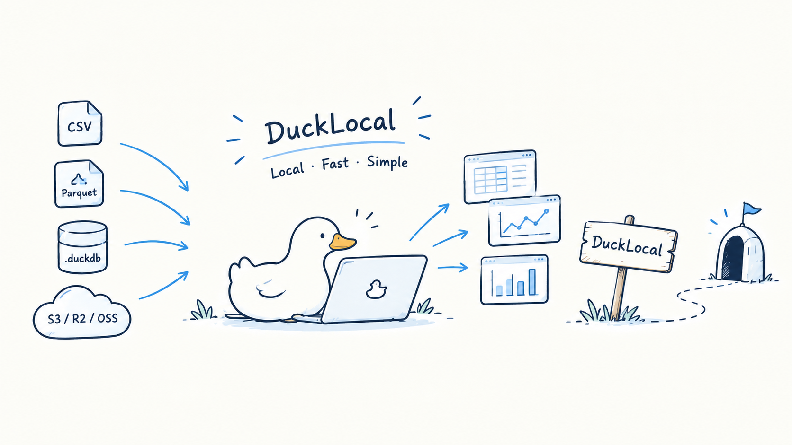

# DuckLocal


**[ducklocal.app](https://ducklocal.app/)** · **[Docs](https://ducklocal.app/docs/)** · **[中文文档](README.zh-CN.md)**

A local-first workspace for querying and exploring your data, built natively on DuckDB. Point it at your files — no connection to configure, no schema to create, nothing uploaded.



## Open your data

```bash
ducklocal ./logs/             # every data file under a folder, recursively
ducklocal ./billing.parquet   # one file
ducklocal './data/*.csv'      # a pattern
ducklocal warehouse.duckdb    # or an existing DuckDB database
```

CSV, TSV, Parquet, JSON, and Excel files are queryable as soon as the window opens. You can also drag them onto the window or pick them from the file dialog; the workspace is remembered for the next launch.

Your data stays on your machine, and there is no account. The only optional network use is the OpenStreetMap base map for map charts (View → Online base map, off by default), and S3 when you configure it.

## Features

- SQL editor with highlighting, autocompletion, formatting, and multiple tabs; run with Cmd+Enter on macOS or Ctrl+Enter on Windows/Linux, inspect plans with EXPLAIN
- Schema sidebar: browse tables and columns, generate SELECTs, change a column's type
- Results grid with filtering, copy, CSV/Parquet export, and built-in charts
- Dashboards as `.dash` files, with cross-filtering
- Query history, S3 via httpfs (session-only credentials)
- Light and dark themes, four interface sizes, English and 简体中文

## CLI for agents

The same binary works headless and returns structured JSON, so an AI agent can explore data without a window:

```bash
ducklocal schema ./data/                                  # what can be queried, with columns
ducklocal query --sql "SELECT * FROM 'sales.csv'" --limit 20
ducklocal check dashboard.dash                            # validate a dashboard spec
ducklocal open --run --sql "SELECT ..."                   # hand a result to the running window
ducklocal open --state                                    # read back what the window shows
```

Database files open read-only unless you pass `--read-write`. See the [CLI guide](https://ducklocal.app/docs/cli) for every command and option.

The [official agent skill](skills/ducklocal/SKILL.md) teaches schema-first exploration, SQL analysis, and file conversion. Copy it into your project:

```bash
mkdir -p /path/to/your-project/.claude/skills
cp -R skills/ducklocal /path/to/your-project/.claude/skills/
```

## Documentation

Guides, a tutorial, and troubleshooting are at **[ducklocal.app/docs](https://ducklocal.app/docs/)** (source: [JetSquirrel/ducklocal-site](https://github.com/JetSquirrel/ducklocal-site)).

## Development

```bash
cargo run                     # start with an empty workspace
cargo run -- ./data/logs/     # or open something straight away
./scripts/bundle.sh           # build target/release/DuckLocal.app (unsigned)
```

Release packaging supports macOS 12+ on Apple silicon, Linux x86_64 and Windows x86_64; `scripts/package-macos.sh` builds the signed, notarized dmg. See [development](https://ducklocal.app/docs/development).

### Windows

```powershell
cargo build --release --locked
python scripts/check-windows.py target/release/ducklocal.exe
```

The executable opens the GUI without a console window and embeds the duck icon for Explorer and the taskbar. CLI commands attach to the caller's console while preserving redirected stdin/stdout/stderr and LSP pipes. In PowerShell, use `Start-Process -Wait -PassThru` when waiting for an exit code, or a pipeline to capture JSON, e.g. `./ducklocal.exe query --sql "SELECT 42" | Out-String`.

For a size-oriented build, use `cargo build --profile compact --locked` (`target/compact/ducklocal.exe`). Rust uses size optimization while DuckDB's C++ engine keeps optimization level 3; both profiles retain LTO and symbol stripping. Compare actual size and performance on the target machine; the normal release stays optimized for speed.

Regenerate the committed Windows icon with `python scripts/make-icons.py --windows` (Pillow required). Normal builds need no Python or Pillow; MSVC builds need the Visual Studio C++ tools and Windows SDK. Run `cargo test --release perf_g_ -- --nocapture --test-threads=1` to compare category-chart allocations, and `perf_h_` for long-text column fitting.

## License

[Apache-2.0](LICENSE) · Copyright © 2026 JetSquirrel
