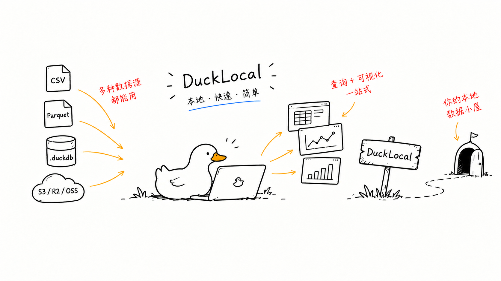

# DuckLocal


**[ducklocal.app](https://ducklocal.app/zh/)** · **[文档](https://docs.ducklocal.app/zh/)** · **[English](README.md)**

本地优先的数据查询与分析工作台，原生基于 DuckDB。直接指向你的文件即可——不用配置连接、不用建 schema，也不会上传任何数据。



## 打开数据

```bash
ducklocal ./logs/             # 递归打开文件夹下的所有数据文件
ducklocal ./billing.parquet   # 单个文件
ducklocal './data/*.csv'      # 通配符
ducklocal warehouse.duckdb    # 或已有的 DuckDB 数据库
```

每个 CSV / TSV / Parquet / JSON / Excel 文件在窗口打开时即可查询。也可以把文件或文件夹拖进窗口，或用文件对话框选择；它们会被记住，下次启动直接回到同一个工作区。一次打开请求最多挂载 256 个文件。

数据只留在这台机器上：不上传、不需要账号。

## 功能

- 把本地 CSV / TSV / Parquet / JSON / Excel 文件或整个文件夹打开为可查询关系：命令行、文件对话框、拖放三种入口
- SQL 编辑器：语法高亮、自动补全、一键格式化，支持多查询 Tab
- ⌘↵（Cmd+Enter）运行查询，EXPLAIN 查看查询计划
- Schema 侧栏：浏览数据库 / schema / 表 / 列，一键生成 SELECT 查询，可在对话框中修改列的数据类型
- 结果表格支持筛选、单元格复制、CSV/Parquet 导出和内置图表
- 查询历史，单击回填编辑器
- 可选 S3 支持（httpfs），凭据仅当前会话有效
- 明暗主题切换，四档界面大小（⌘+ / ⌘− / ⌘0），中英文界面

## AI CLI 与官方 skill

无窗口执行一条 SQL，不读取 GUI 历史或设置：

```bash
ducklocal --help
ducklocal query --sql "DESCRIBE SELECT * FROM 'sales.csv'"
ducklocal query --sql "SELECT * FROM 'sales.csv'" --limit 20
ducklocal query --database warehouse.duckdb --sql "SHOW TABLES"
```

结果为结构化 JSON，显式标记截断并保留数值精度；`--format md` 把同样的值输出为 Markdown 表格，便于写进文档引用。文件数据库默认只读，写入需 `--read-write`；只读不是文件系统/网络沙箱，`COPY` 仍可写文件。

分析应用可以导出为一个独立 HTML 文件——应用 `query()` 发出的语句及其结果——方便发给没有 DuckLocal 的人：

```bash
ducklocal export --html examples/analysis_app
```

dashboard 也可以声明为数据：一个由 query 和 plot block 组成的 `.dash` 文件，像应用一样以标签页打开，并可直接在 GUI 里编辑。`ducklocal check` 无窗口校验规格文件，`ducklocal lsp` 则把同样的诊断、补全、悬停和跳转定义提供给任何支持 LSP 的编辑器：

```bash
ducklocal dashboard.dash                  # 以 dashboard 标签页打开
ducklocal check dashboard.dash            # 校验；JSON 诊断，有错误时退出码 2
ducklocal lsp                             # 面向编辑器的语言服务器（stdio）
```

转换、stdin、输出编码、应用导出和安全说明见 [CLI 指南](https://docs.ducklocal.app/zh/cli)。

[官方 agent skill](skills/ducklocal/SKILL.md) 教 AI 先查 schema，再进行 SQL 分析及验证格式转换。复制到目标项目支持的 skill 目录即可，例如在本仓库执行：

```bash
mkdir -p /path/to/your-project/.claude/skills
cp -R skills/ducklocal /path/to/your-project/.claude/skills/
```

目标已存在时先检查，避免覆盖。不修改全局配置。当前发布范围为 macOS 12+、Apple 芯片；app 内二进制位于 `/Applications/DuckLocal.app/Contents/MacOS/ducklocal`。先检查 help/version 是否支持 CLI，或 `cargo build --locked` 后用 `./target/debug/ducklocal`。

## 文档

完整指南在 **[docs.ducklocal.app](https://docs.ducklocal.app/zh/)**：[快速上手](https://docs.ducklocal.app/zh/getting-started)、带样例数据的 [10 分钟上手教程](https://docs.ducklocal.app/zh/tutorial)、[常见问题排查](https://docs.ducklocal.app/zh/troubleshooting)、[数据源](https://docs.ducklocal.app/zh/data-sources)、[S3 与 httpfs](https://docs.ducklocal.app/zh/s3)、[SQL 编辑器](https://docs.ducklocal.app/zh/sql-editor)、[Schema 浏览与历史](https://docs.ducklocal.app/zh/schema-and-history)、[结果与图表](https://docs.ducklocal.app/zh/results-and-charts)、[设置与应用数据](https://docs.ducklocal.app/zh/settings-and-data)、[Dashboard](https://docs.ducklocal.app/zh/dashboards)、[开发](https://docs.ducklocal.app/zh/development)。

网站——[ducklocal.app](https://ducklocal.app/zh/) 产品首页与文档——放在独立的仓库 [JetSquirrel/ducklocal-site](https://github.com/JetSquirrel/ducklocal-site)。这里的改动如果改变了文档里的说法，也需要向那边提交 pull request。

## 运行

```bash
cargo run                     # 启动空工作区
cargo run -- ./data/logs/     # 或直接打开数据
```

## 打包 macOS 应用

```bash
./scripts/bundle.sh
# 生成 target/release/DuckLocal.app
```

发布的安装包要求 macOS 12 及以上、Apple 芯片。`bundle.sh` 不做签名；正式发布走 `scripts/package-macos.sh`，它会签名并对 dmg 做公证。详见[开发](https://docs.ducklocal.app/zh/development)。

## 开源协议

[Apache-2.0](LICENSE) · Copyright © 2026 JetSquirrel
