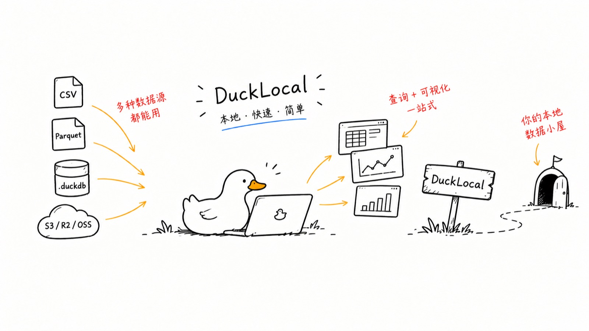

# DuckLocal

**[中文文档](zh/index.md)** · [Project README](https://github.com/JetSquirrel/DuckLocal#readme)

A local-first workspace for querying and exploring your data, built natively on DuckDB.
Point it at your files — there is no connection to configure, no schema to create,
and nothing is uploaded anywhere.

macOS 12 or later, Apple silicon. Free and open source under Apache-2.0.
[Download for macOS](https://github.com/JetSquirrel/DuckLocal/releases/latest) ·
[View on GitHub](https://github.com/JetSquirrel/DuckLocal)

## Guides

| Guide | What it covers |
| --- | --- |
| [Getting started](getting-started.md) | Install DuckLocal, open your first files, run your first query |
| [Data sources](data-sources.md) | Which file formats are supported, how folders and patterns resolve, how databases open, view naming, and the limits |
| [S3 and httpfs](s3.md) | Point DuckLocal at an S3-compatible bucket, browse it, and query objects |
| [SQL editor](sql-editor.md) | Query tabs, running and formatting SQL, EXPLAIN, and autocompletion |
| [Schema browser and history](schema-and-history.md) | Browse tables and columns, generate SELECT statements, alter column types, and reuse past queries |
| [Results and charts](results-and-charts.md) | The results grid, filtering, copying, export, and the built-in charts |
| [Settings and app data](settings-and-data.md) | Where DuckLocal keeps its files, what survives a restart, themes, language, and troubleshooting |
| [AI CLI and official skill](cli.md) | Run headless SQL, inspect the JSON contract, and install the official agent skill |
| [Analysis panels](analysis-panel.md) | Open a window whose contents are a JavaScript panel you wrote, over the same connection |
| [Development](development.md) | Build, test, bundle a `.app`, and cut a signed and notarized release |

## At a glance

- Local CSV / TSV / Parquet / JSON / Excel files, or whole folders —
  from the command line, the file dialog, or a drop on the window
- SQL editor with syntax highlighting, autocompletion, formatting, and
  multiple tabs
- Schema sidebar for browsing databases, schemas, tables, and columns
- Results grid with filtering, cell copy, CSV and Parquet export, and charts
- Query history, optional S3 support, light and dark themes, English and 简体中文
